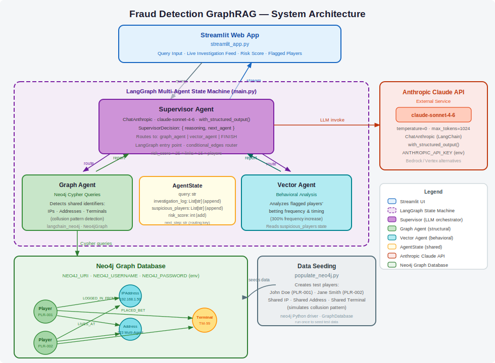

# Fraud Detection GraphRAG

A multi-agent fraud detection system that combines graph-based structural analysis (Neo4j) with behavioral anomaly detection, orchestrated by an LLM supervisor using LangGraph.

## How it works

The system runs three agents in a loop coordinated by a supervisor:

1. **Supervisor** — an LLM (Claude Sonnet 4.6) that reads the investigation log and decides which agent to call next, or when to finish.
2. **Graph Agent** — queries Neo4j for players sharing IP addresses, home addresses, or betting terminals — structural patterns indicative of collusion. Results are interpreted by the LLM in the context of the user's query.
3. **Vector Agent** — fetches actual betting records (amounts, terminals, historical averages) for flagged players from Neo4j, then uses the LLM to surface anomalies relevant to the user's query.

Each agent appends to a shared `investigation_log` and accumulates a `risk_score`. The supervisor routes between agents until it has enough evidence to `FINISH`.

```
START → supervisor → graph_agent → supervisor → vector_agent → supervisor → END
```

## Graph schema

```
(Player)-[:LOGGED_IN_FROM]->(IPAddress)
(Player)-[:LIVES_AT]->(Address)
(Player)-[:PLACED_BET]->(Terminal)
```

## Web Interface

A Streamlit UI is included for interactive investigations:

```bash
uv run streamlit run streamlit_app.py
```

Open http://localhost:8501, enter your query, and click **Run Investigation**. The interface streams supervisor decisions and agent findings live, then summarises flagged players and the final risk score.

## Docs




## Setup

**Prerequisites:** Python 3.12+, a running Neo4j instance, an Anthropic API key.

1. Install dependencies:
   ```bash
   uv sync
   ```

2. Create a `.env` file:
   ```
   ANTHROPIC_API_KEY=...
   NEO4J_URI=bolt://localhost:7687
   NEO4J_USERNAME=neo4j
   NEO4J_PASSWORD=...
   ```

3. Seed the database with test data:
   ```bash
   uv run populate_neo4j.py
   ```

4. Run the investigation:
   ```bash
   uv run main.py
   ```

## Example output

```
--- Supervisor Reasoning: Starting with structural analysis to find shared identifiers. ---
--- Supervisor Reasoning: Behavioral analysis needed for flagged players. ---
--- Supervisor Reasoning: Sufficient evidence gathered. Finalizing. ---

--- FLAGGED PLAYERS ---
  * John Doe
  * Jane Smith

--- FINAL INVESTIGATION LOG ---
- Graph Agent: Found 3 suspicious link(s):
    - John Doe <-> Jane Smith (shared IPAddress)
    - John Doe <-> Jane Smith (shared Address)
    - John Doe <-> Jane Smith (shared Terminal)
  Analysis: John Doe and Jane Smith share an IP address, home address, and betting terminal,
  strongly suggesting coordinated activity or a single actor operating multiple accounts.
- Vector Agent: Betting data for 2 player(s):
    - Jane Smith: bet $4800 at Casino Floor A (historical avg: $45)
    - John Doe: bet $5000 at Casino Floor A (historical avg: $50)
  Analysis: Both players placed bets roughly 100x their historical averages at the same terminal,
  a highly anomalous pattern consistent with coordinated collusion or match-fixing.

FINAL RISK SCORE: 105
```
